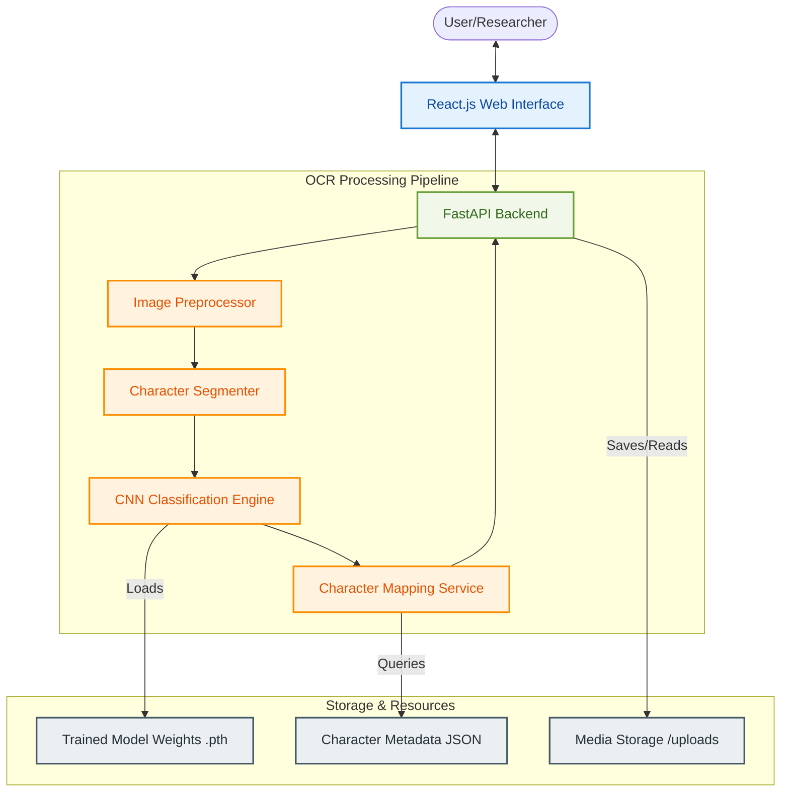
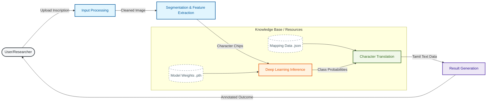
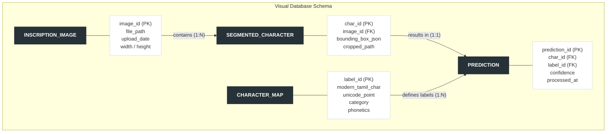

# Project Documentation: VatteluttuX

## Abstract

**Project Title: VatteluttuX: Enhancing Epigraphical Research through Deep Learning-Based OCR and Modern Tamil Mapping.**

The preservation of cultural heritage is a critical endeavor that bridges the gap between ancient wisdom and modern understanding. Tamils, with a rich history spanning over two millennia, possess a vast collection of inscriptions written in the ancient Vatteluttu script. However, the scarcity of experts capable of deciphering these scripts has left much of this history inaccessible. VatteluttuX is a comprehensive technical solution designed to automate the recognition and translation of these inscriptions into modern Tamil, thereby democratizing access to historical narratives.

### Section 1: What is this project? (Purpose and Scope)
The project encompasses the entire pipeline of digital epigraphy, starting from high-resolution image acquisition of stone inscriptions to the final presentation of translated text. The scope includes character segmentation using advanced image processing techniques to isolate individual Vatteluttu letters, followed by a robust classification engine powered by Convolutional Neural Networks (CNN). The system also features a bidirectional character mapping database that ensures phonetic and semantic accuracy during the conversion to modern Tamil characters. Furthermore, a web-based interface provides researchers and historians with an intuitive platform for uploading images, viewing character-by-character analysis, and managing the digital archives of epigraphical data. The system is designed to handle various noise profiles found on weathered stone surfaces, making it a practical tool for field research.

### Section 2: Why this project? (Business Justification and Benefits)
Traditional methods of script decipherment are labor-intensive, time-consuming, and prone to human error. VatteluttuX addresses these challenges by significantly reducing the time required for translation, enabling researchers to process thousands of inscriptions that were previously backlogged. The business justification lies in the efficiency gains and the systematic digitization of cultural assets, which can be shared globally for scholarly collaboration. By providing a standardized tool for OCR, the project minimizes the reliance on a dwindling number of traditional experts and ensures that the knowledge contained within these inscriptions is not lost to time. The resulting digital repository also serves as a valuable resource for linguists studying the evolution of the Tamil language, providing a quantitative basis for historical analysis.

### Section 3: How will this project be executed? (Methodology and Usage Approach)
The project follows an agile development methodology, integrating cutting-edge machine learning frameworks with modern web technologies. The core engine is built using Python, leveraging the PyTorch library for training and deploying deep learning models. Image preprocessing involves noise reduction, contrast normalization, and adaptive thresholding for better feature extraction. The backend API is developed using FastAPI, ensuring high performance and ease of integration. On the frontend, React.js is utilized to create a responsive and interactive user experience. The data flow starts with user-uploaded images, which are processed through the segmentation layer, classified by the CNN model, mapped against the Modern Tamil character metadata, and finally returned as a structured response to the frontend for visualization. This modular approach allows for continuous improvement of the recognition model without disrupting the core application services.

---

## Architectural Design Diagram

---

## Data Flow Diagram (DFD - Level 1)

---

## Entity-Relationship (ER) Diagram

---

## Data Table Specification

| FIELD | TYPE | SIZE | DEFINITION |
| :--- | :--- | :--- | :--- |
| `image_id` | UUID | 36 | Primary Key; Unique identifier for uploaded inscription image (NOT NULL) |
| `file_path` | VARCHAR | 255 | Local or cloud storage path to the original image file (NOT NULL) |
| `upload_date` | TIMESTAMP | - | Date and time when the image was uploaded (NOT NULL) |
| `char_id` | UUID | 36 | Primary Key; Unique identifier for a segmented character (NOT NULL) |
| `bounding_box` | JSON | - | Coordinates `[x, y, w, h]` of character in original image (NOT NULL) |
| `label_id` | VARCHAR | 10 | Foreign Key; Internal model class identifier e.g., 'va_001' (NOT NULL) |
| `confidence` | FLOAT | - | Probability score (0.0 to 1.0) of the prediction (NOT NULL) |
| `modern_char` | NVARCHAR | 5 | The modern Tamil equivalent character (NOT NULL) |
| `category` | VARCHAR | 20 | Linguistic category (Vowel, Consonant, etc.) (NULL) |
| `processed_at` | TIMESTAMP | - | Timestamp of when the OCR process was completed (NOT NULL) |
